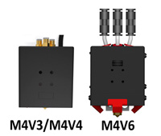

<!-- ### :globe_with_meridians: Choose Language (Translated by google)

----- -->
## :warning: NOTICE 
### Please choose the documents based on your hot end model.
**Note:** Default Z8PM4Pro-MK1 equipped with a M4V4 hot end and Z8PM4Pro-MK2 equipped with a M4V6 hot end.     

#### [How to clean a blocked/clogged M4V6 hot end](https://github.com/ZONESTAR3D/Z8P/blob/main/Z8P_FAQ/Issue_mix_color_hotend_clogged/Clean_clogged_M4V6.md)
#### [How to clean a blocked/clogged M4V3/M4V4 hot end](./Clean_clogged_M4V4.md)
