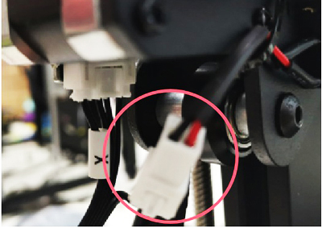
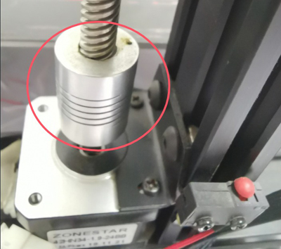

# Homing Issues

-----
## The normal moving process of the machine after doing "Home All":
1. The print head will move up 10mm. **[Z axis, L&R]**
2. The print head moves to the left until the X carrier triggers X ENDSTOP and then stop. **[X axis]**
3. The heat bed moves back until Y ENDSTOP is triggered and then stop. **[Y axis]**
4. The print head move down until both Z-end stops are triggered and then stop. **[Z axis, L&R]**      
#### These components may cause Homing issue:
- Wiring of X/Y/ZL/ZR motor and limit switches.
- Stepper motors.
- Limit switches(/ENDSTOPs).
- Motor drive modules on the control board. 
- The control board. 
- the coupling which connecting Z-axis motors and lead screws.     
- Mechanical components related to XYZ axis movement.
	
-----
## Issues
Firstly, you can follow the [:movie_camera: **electronics parts auto testing video tutorial**](https://youtu.be/iSsuy2ePWw8) to check the ENDSTOPs and motors, if you find a problem during testing, click the link of the problem source listed below to get the solution.  
- :point_right: [**X ENDSTOP or motor don't work**](#Xissue).
- :point_right: [**Y ENDSTOP or motor don't work**](#Yissue).
- :point_right: [**Z ENDSTOPs or motors don't work**](#Zissue).  

### <a id="Xissue">X ENDSTOP don't work?</a>
1. Check X ENDSTOP wiring. 
2. Check X wiring on the control boad. [:point_right: Wiring Diagram](#Z8P_wiring)  
3. Check that the X limit switch is well soldered to the wire and that the wire is connected to the NO and COM pins of the limit switch.   
        
:warning: The connection between the wire and the limit switch is wrapped, and even if there is poor contact, it cannot be seen. You can use a multimeter to check, or swap the left and right limit switches to check.

### <a id="Yissue">Y ENDSTOP don't work?</a>
1. Check Y ENDSTOP wiring.    
2. Check Y wiring on the control boad.[:point_right: Wiring Diagram](#Z8P_wiring)  
3. Check that the Y limit switch is well soldered to the wire and that the wire is connected to the NO and COM pins of the limit switch.
        

### <a id="Zissue">Z ENDSTOPs or motors don't work?</a>
##### ZL/ZR ENDSTOPs don't work?
1. Check Z ENDSTOPs wiring (Both the left and right).    
2. Check the Z ENDSTOPs (Both the left and right).    
3. Check Z axis wiring on the control board.[:point_right: Wiring Diagram](#Z8P_wiring)  
        

#####  ZL/ZR Motor don't work?
1. Check if ZL/ZR motor wiring well.      
                
2. Check the screws on the coupling which to fix the motor shaft with the lead screws, the screws may have been loosened during transportation.          
       
3. Check ZL/ZR Motor wiring on the control board.[:point_right: Wiring Diagram](#Z8P_wiring)  

#### <a id="Z8P_wiring">Z8P Wiring on Board Side</a>
       

-----
### :email: If you can't find a solution to solve your problem after read this document, please contact our technical support team: support@zonestar3d.com .