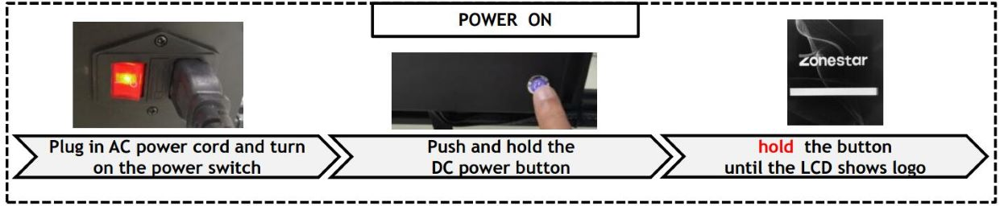
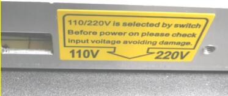

<!-- ### :globe_with_meridians: Choose Language (Translated by google)

----- -->
## The printer can't start up
:loudspeaker: First of all , We hope you know that you need to turn of the AC power switch and then ***press and hold the DC button for about 5 seconds*** until you see the ZONESTAR logo on the LCD screen.    
     
**[:clapper: Turn On / Turn Off the printer](https://youtu.be/2i8ozM2Dn1U)**

----
### To choose the solution according to the status of your printer.
##### The light on AC switch doesn't light up. [:point_right:Get solution](#1-check-the-ac-power-voltage-select-switch)
##### The light on AC switch light up, but when we push and hold the DC button, the LCD Screen don't show anything. [:point_right:Get solution](#3-the-light-of-dc-button-does-light-up)
<!-- ##### The LCD screen can shows menu, but the printer reset itself after shows "heating fail" menu. [:point_right:Get solution](../Issue_heating/readme.md) -->
##### The LCD screen only show a ZONESTAR logo and don't shows menu, and the printer auto turn off after the DC button is released. [:point_right:Get solution](#4-upload-the-firmware)
##### My situation does not correspond to any of the above status. [:point_right:Get solution](#contact-our-support-team)

----
### Checking steps
#### 1. Check the AC power voltage select switch.
Check if the AC power voltage has been set (110V/230V) correctly according to your city power voltage.     
   
#### 2. The AC power switch doesn't light up?
- Check if AC power cord is connected well with the AC connector, or replace a new AC power cord and try again.     
     
- Open the control box and check if the terminals of the AC power switch connected well.     
     
#### 3. The light of DC button does light up
    
:white_check_mark: **Yes, go to the next step**[:point_right:](#4-upload-and-try-again)   
:negative_squared_cross_mark: **Not, following the below steps to do**  
- Remove SD card and try again.     
- Disconnect the LCD cable and try again.     
#### 4. Upload the firmware
Please try to download the firmware and upload it to your printer again. [:point_right:](https://github.com/ZONESTAR3D/Firmware/tree/master/Z8/Z8P)

----
### Contact our support team.
If you still haven't fixed the question after did above 5 steps, contact our tech-support team [:email: support@zonestar3d.com](support@zonestar3d.com).
