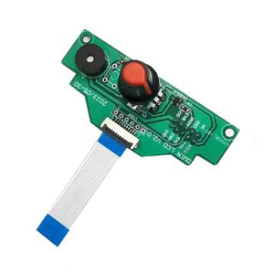

## <a id="choose-language">:globe_with_meridians: W?hle Sprache</a>

----
# Z8P Fehlerbehebung

-----
## Referenz
Um Probleme mit dem Produkt zu finden und zu l?sen, müssen Sie m?glicherweise die automatische Testfunktion verwenden, die Steuerungsbox ?ffnen, um die Verkabelung zu überprüfen, oder die Motorantriebsspannung einstellen, einen "Tauschtest" verwenden, um einen elektronischen Bauteil zu überprüfen, etc.. Hier listen wir diese Anleitungen, Bilder und Videoanleitungen für Ihre Referenz auf.
### Verkabelung
- [:art: Wie ?ffnet man die Steuerungsbox](./pic/OpenControlBox.png)
- [:art: Verkabelung auf der Steuerungsplatine](./pic/Z8P_wiring.png)

### Automatische Tests von elektronischen Bauteilen
Das Z8P verfügt über ein eingebautes Programm zur automatischen Tests von elektronischen Bauteilen. Sie k?nnen dieses Programm verwenden, um zu bestimmen, wo das Problem liegt, wenn ein elektronischer Bauteil ein Problem hat. Um dieses Programm zu starten, müssen Sie das Menü "**Info**" ?ffnen und den Knopf drehen, um auf das Element "**Datum: xx-xx-xx**" zu zeigen, und dann den Knopf fünf Mal drücken.
#### Videoanleitung

### über "Tauschtest"
Wenn wir feststellen, dass es ein funktionales Problem in der Maschine gibt und die Ursache des Problems mehrere M?glichkeiten hat (mehrere Teile k?nnen das gleiche Problem verursachen), haben wir die M?glichkeit, den sogenannten "Tauschtest" zu verwenden, um die Ursache des Problems so schnell wie m?glich zu lokalisieren.
Zum Beispiel, wenn der linke Z-Achsenmotor nicht funktioniert, kann das Problem von der Verkabelung, dem Schrittmotor, dem Motorkabel, dem Motorantriebsmodul auf der Steuerungsplatine oder der Steuerungsplatine selbst stammen. Da es zwei identische Z-Achsenantriebssysteme in der Maschine gibt - linkes und rechtes Z-Achsenantriebssystem - k?nnen wir die gleichen Teile/Bauteile/Kabel auf der linken und rechten Seite nacheinander austauschen, um zu bestimmen, wo das Problem liegt.
Die in der Maschine durchzuführenden Teile für den Austauschtest umfassen:
- X/Y-Motor und Endschalter.
- ZL/ZR-Motor und Endschalter
- 4 Extrudermotoren
- Patronenheizer und Temperatursensor der Hei?e Bett- und Hotendkammer.

-----
## Inhalte
- **[Das Ger?t kann nicht starten](./Issue_of_startup/readme.md)**
- **[Homing-Problem](./Issue_of_Homing/readme.md)**
- **[Heizungsproblem](./Issue_heating/readme.md)**
- **[Automatisches Herunterfahren beim Drucken von SD-Karte](./Issue_auto_shut_down/readme.md)**
- **[Wie man das Hotend/Extruder Blockage-Problem behebt](./Issue_extruder_blocked/readme.md)**
- **[Wie man das Extruder-Unterdruck-Problem behebt](./Issue_of_Extruder_insufficient_discharge/readme.md)**
- **[Absturz beim Verbinden per USB in Cura](./issue_of_connect_USB_in_Cura/readme.md)**
- **[Die Drucker pausiert automatisch beim Drucken von SD-Karte](./Issue_auto_pause/readme.md)**
- **[Problem, die SD-Karte nicht zu lesen](./Issue_not_read_sdcard/readme.md)**
- **[LCD-Bildschirm-Knopf-Problem](#dwinscreen)**

----
## Sonstige Referenzen
- **[44 h?ufige 3D-Druckprobleme](https://github.com/ZONESTAR3D/Document-and-User-Guide/tree/master/FAQ)**
- **[Alle Probleme und L?sungen (@All3DP.com)](https://all3dp.com/1/common-3d-printing-problems-troubleshooting-3d-printer-issues/)**

-----
## <a id="dwinscreen">LCD-Bildschirm-Knopf-Problem</a>
Wenn Sie feststellen, dass der Knopf des LCD-Bildschirms stecken geblieben ist, k?nnen Sie auf [:gift: diesen Link](https://www.aliexpress.com/item/3256805596235491.html) klicken, um eine Ersatztastatur zu kaufen. Wenn Ihr Produkt im Garantiezeitraum liegt (innerhalb von 12 Monaten ab dem Empfang des Pakets), wenden Sie sich bitte nach der Bestellung an uns, und wir werden Ihnen den Nachverkaufsservice为您提供.
Wie man die Tastatur des LCD-Bildschirms ersetzt, siehe Videoanleitung:
- Für die L?tversion (?lter), siehe [:clapper: dieses Video](https://youtu.be/Xwfczp3nLOY).   
- Für die FPC-Version (neuer), siehe [:clapper: dieses Video](https://youtu.be/z9E6glRZRIQ).  
####

-----
## :email: Wenn Sie keine L?sung für Ihr Problem nach dem Lesen der FAQ finden, wenden Sie sich bitte an unser technisches Support-Team: support@zonestar3d.com .