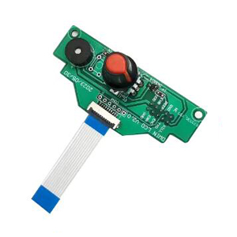

## <a id="choose-language">:globe_with_meridians: Выберите язык</a>

----
# Устранение неисправностей Z8P

-----
## Справка
Для того чтобы найти и решить проблемы с продуктом, вам, возможно, придется использовать функцию автоматического тестирования, открыть коробку управления для проверки проводов или настроить ток моторного привода, использовать "тест замены" для проверки электронных компонентов и т. д. Здесь мы предоставляем эти руководства, изображения и видеоуроки для вашей справки.
### Проводка
- [:art: Как открыть коробку управления](./pic/OpenControlBox.png)
- [:art: Проводка на плате управления](./pic/Z8P_wiring.png)

### Автоматические тесты электронных компонентов
Z8P имеет встроенную программу автоматических тестов электронных компонентов. Вы можете использовать эту программу, чтобы определить, откуда возникает проблема, когда какой-либо электронный компонент сталкивается с проблемой. Для запуска этой программы вам необходимо открыть меню "**Инфо**" и повернуть ручку, чтобы указать на элемент "**Дата: гг-мм-дд**", а затем нажать на ручку пять раз.
#### Видеоурок

### О "тесте замены"
Когда мы обнаруживаем функциональную проблему в машине, и причиной проблемы может быть несколько вариантов (несколько частей могут вызвать одну и ту же проблему), у нас есть возможность использовать так называемый "тест замены" для быстрого определения причины проблемы.
Например, если левый мотор оси Z не работает, проблема может быть связана с проводами, шаговым мотором, кабелем мотора, модулем управления мотором на плате управления или самой платой управления. Поскольку в машине есть два одинаковых системы управления осью Z - левая и правая системы управления осью Z, мы можем поочередно менять одни и те же детали/компоненты/провода на левой и правой сторонах, чтобы определить, откуда возникает проблема.
Части в машине, для которых можно провести тест замены:
- Моторы X/Y и концевые переключатели.
- Моторы ZL/ZR и концевые переключатели
- 4 комплекта экструдеров
- Картриджиные нагреватели и датчики температуры горячей платформы и горячей головки.

-----
## Содержание
- **[Машина не может быть включена](./Issue_of_startup/readme.md)**
- **[Проблема с.homing](./Issue_of_Homing/readme.md)**
- **[Проблема с нагревом](./Issue_heating/readme.md)**
- **[Автоматическое выключение при печати с SD-карты](./Issue_auto_shut_down/readme.md)**
- **[Как исправить проблему с за赌ом горячей головки/экструдера](./Issue_extruder_blocked/readme.md)**
- **[Как исправить проблему недостатка выталкивания экструдера](./Issue_of_Extruder_insufficient_discharge/readme.md)**
- **[Сбой при подключении USB в Cura](./issue_of_connect_USB_in_Cura/readme.md)**
- **[Принтер автоматически останавливается при печати с SD-карты](./Issue_auto_pause/readme.md)**
- **[Проблема с чтением SD-карты](./Issue_not_read_sdcard/readme.md)**
- **[Проблема с кнопкой экрана LCD](#dwinscreen)**

----
## Дополнительные ссылки
- **[44 распространенных проблемы при 3D-печати](https://github.com/ZONESTAR3D/Document-and-User-Guide/tree/master/FAQ)**
- **[Все проблемы и решения (@All3DP.com)](https://all3dp.com/1/common-3d-printing-problems-troubleshooting-3d-printer-issues/)**

-----
## <a id="dwinscreen">Проблема с кнопкой экрана LCD</a>
Если вы обнаружите, что кнопка экрана LCD застряла, вы можете нажать на [:gift: эту ссылку](https://www.aliexpress.com/item/3256805596235491.html) для покупки замены клавиатуры. Если ваш продукт в гарантийном期内 (в течение 12 месяцев с даты получения пакета), пожалуйста, свяжитесь с нами после оформления заказа, и мы предоставим вам послепродажное обслуживание.
Как заменить клавиатуру экрана LCD, пожалуйста, посмотрите видеоурок:
- Для сварной версии (старой), пожалуйста, обратитесь к [:clapper: этому видео](https://youtu.be/Xwfczp3nLOY).   
- Для версии FPC (новой), пожалуйста, обратитесь к [:clapper: этому видео](https://youtu.be/z9E6glRZRIQ).  
####

-----
## :email: Если вы не найдете решение вашей проблемы после прочтения FAQ, пожалуйста, свяжитесь с нашей технической поддержкой: support@zonestar3d.com .