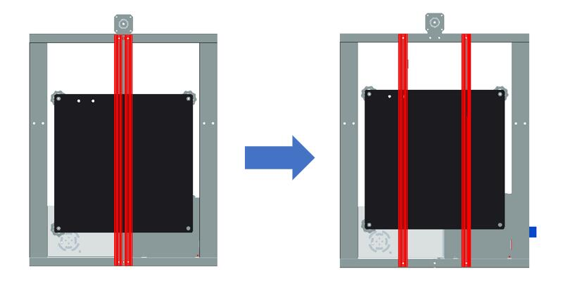
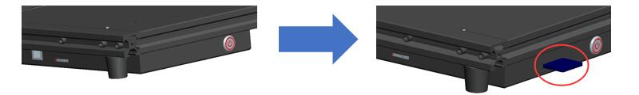

### :globe_with_meridians: Choose Language (Translated by google)

----
# Z8P Documents
Z8P series is a high cost performance multi-color FDM 3D printer launched by ZONESTAR in 2022.    
#### Features:
- Classic independent XYZ cartier coordinate structe.
- The motion structure adopts the V-solt profile frame and the wheels, and it equiped with double Z axes driver.
- 300x300x400mm build volume.
- 32-bit control main board with silent motor drivers.
- Titan extruder and mix color hotend, support gradient color and multi color printing.
- Equiped with 250W hotbed and magnetic PC film flexible hot bed sticker.
- 70% Pre-assemble rate, fast installation.
- Built-in automatic color mixing feature, one-button to convert single color 3D model to multi-color 3d prints.
- Supports to paint color on 3D model, to convert one color 3D model to multi color model for printing.
- With bed auto leveling feature.
- Automatically resume printing after power failure.
- Automatic shutdown after printing.
- Open source firmware.
The Z8P series has two models:
1. **Z8PM3**: 3 extruder + 3-IN-1-OUT color mixing hot end + LCD12864 display control panel.
2. **Z8PM4Pro**: 4 extruder + 4-IN-1-OUT color mixing hot end + 4.3 "TFT-LCD display control panel.  

## :file_folder:[Z8P-MK2](./Z8P-MK2/)
The 2nd version Z8P
#### Features:
- Classic cartier coordinate (independent XYZ) structe.
- The motion structure adopts the V-solt profile frame and the wheels, equipped with dual Z axes drivers.
- Build volume up to 300x300x400mm.
- 32-bit control board with TMC silent motor drivers.
- 4x Titan extruders and 4-IN-1-OUT mix color hot end, support gradient color and multi color printing.
- 4.3" TFT-LCD screen control panel.  
- Equipped with 250W hot bed and magnetic PC film flexible sticker.
- 70% Pre-assemble, fast installation.
- Built-in automatic color mixing feature, one-button to convert single color 3D model to multi color 3d prints.
- Supports to paint color on 3D model to convert one color 3D model to multi color model.
- With bed auto leveling feature.
- Support high speed pringing, flow rate of hot end up to 30mm3/s
- Automatically resume printing after power failure.
- Automatic shutdown after printing finished.
- 5-languages operature menu (EN/ES/PT/FR/RU).
- Open source firmware.
#### The main upgrades in Z8P-MK2:
1. Improved profiles to make the appearance more beautiful.
2. Upgraded the hot end to the 6th version mix color hot end.
3. Changed the motor drivers for X/Y/Z axis to TMC2208.
#### Z8P-MK2 has been upgraded to Z8P-MK2A since 2024, the main upgrades of Z8P-MK2A:
1. Modified the Y-axes rail to 2 pieces of 2020 v-slot profiles.

2. Add a SD card socket on the control box.

3. Upgraded the control board from ZM3E4V2.x to ZM3E4V3.x

## :file_folder:[Z8P](./Z8P/)
The first version of Z8P.